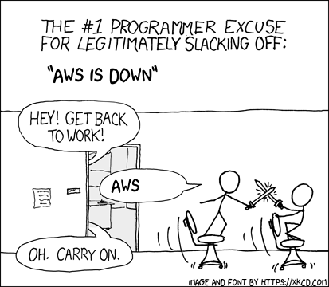

Programmer's excuse generator
===========================
Simple image generator in Go, based on XKCD's famous [compiling comic](https://xkcd.com/303/).

# How to use
After having built, just execute
```
$ ./go-excusegen -long "aws is down" -short "aws"
```
which will then produce a PNG image in the root directory.




# License
This software is distributed under the terms of the MIT license. See LICENSE for details.

# Credit
Graphic resources (image & font) by [XKCD](https://xkcd.com)
